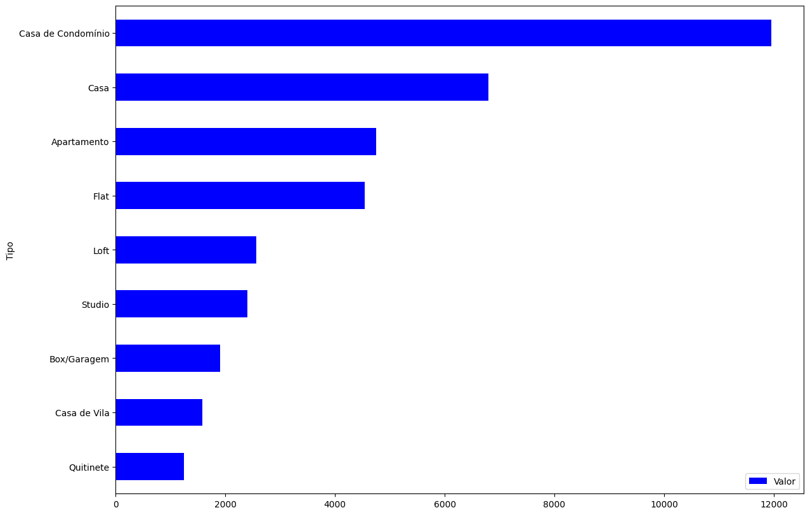

# O que aprendemos?


## Dados

Dados disponibilizados no site [alura](https://raw.githubusercontent.com/alura-cursos/pandas-conhecendo-a-biblioteca/main/base-de-dados/aluguel.csv):

Este conjunto de dados inclui dados de alugueis na cidade do rio de janeiro.

## Dicionario de dados

- Tipo: informa o tipo do imovel(apartamento/casa)
- Bairro: Bairro onde está localizado esse imovel
- Quartos: qtd de quartos do imovel
- Vagas: qtd de vagas do imovel
- Suites: qtd de suites do imovel 
- Area: informação da área/tamanho do imovel
- Valor: valor do imovel
- Condominio: valor do condominio
- Iptu: valor do iptu

## Etapas do processo de limpeza/modificação

1. Carregar dados
2. Criar Dicionario
3. Analises(responder perguntas de negocios)

## Analise dos dados

1. Qual o valor médio dos Alugueis por tipo de imovel?

Em nossa base temos dados de imoveis residenciais e comerciais, para isso precisamos limpar para que nosso dataframe traga somente dados residenciais.

**Passo 01**

- Listamos todos os imoveis comercial em uma nova lista
```{python}
imoveis_comerciais = ['Conjunto Comercial/Sala', 'Prédio Inteiro', 'Loja/Salão', 'Galpão/Depósito/Armazém', 'Casa Comercial',
                      'Terreno Padrão', 'Loja Shopping/ Ct Comercial', 'Chácara', 'Loteamento/Condomínio', 'Sítio', 'Pousada/Chalé', 'Hotel', 'Indústria']

```

- Em sequencia usamos o Metodo **query** para filtrar nossos dados e retirar os valores contidos na lista de imoveis comerciais

```{python}
imoveis_residenciais = dados.query('@imoveis_comerciais != Tipo')  # podemos usar o not in / in
```

- Agora podemos agrupar os dados e mostrar a analise dos dados conforme o tipo de imovel.


```{python}
analise_residencial = imoveis_residenciais.groupby('Tipo')[['Valor']].mean().sort_values('Valor')
analise_residencial.plot(kind='barh', figsize=(14,10), color="blue")n
```


2. Qual percentual de cada tipo imovel na nossa base de dados?


